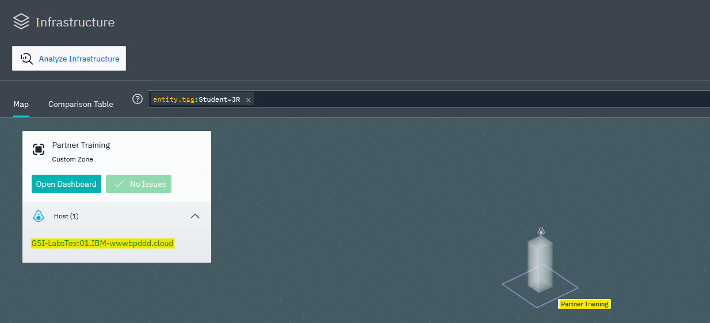
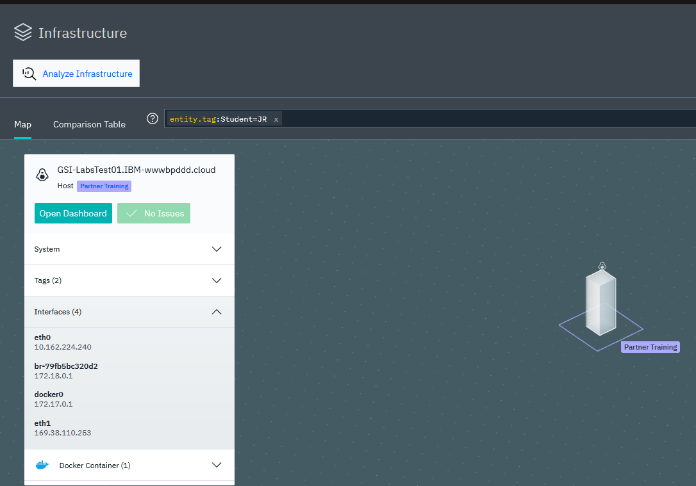
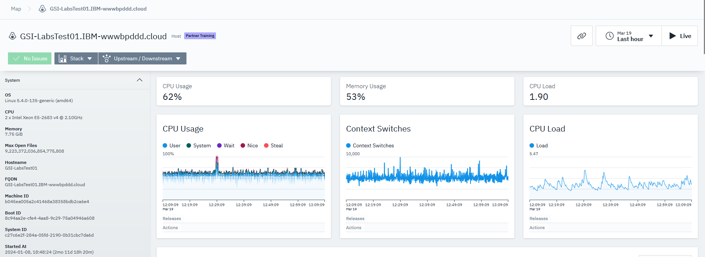
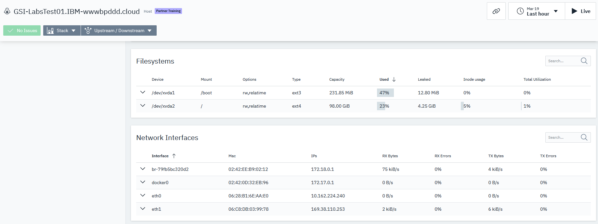
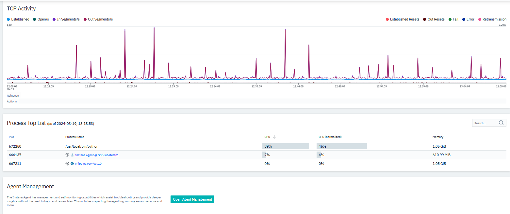
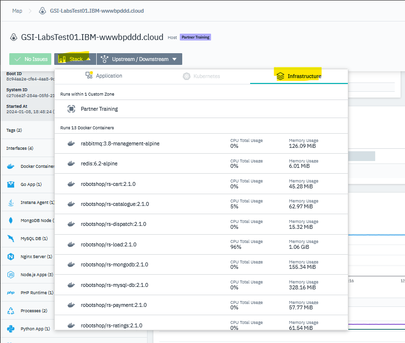
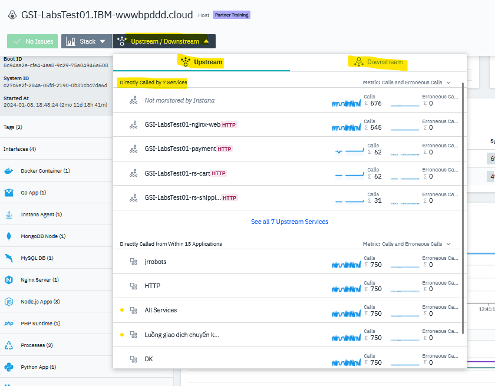

export const Title = () => (
  <span>
    Lab 2 - Infrastructure monitoring and DFQ <br />
  </span>
);
;

## Lab Overview

In this lab you will be introduced to the DFQ (Dynamic Focus Query) search functionality and infrastructure monitoring. The Instana Dynamic Focus search functionality can be used to filter the 3D maps, comparison tables, and incident views. The search bar has extensive abilities to search using fuzzy and wildcard searches as well as boolean operators. 

## Step 1:
Navigate to the Infrastructure screen in the UI.


## Step 2:

Use the following DFQs: 

```
entity.host.name:<your_host_name> 
```

```
entity.host.name:<your_host_name> entity.type:host 
```

```
entity.host.name:<your_host_name> entity.selfType:host 
```

```
entity.zone:"Partner Training" 
```

```
entity.tag:Student=<your_last_name> 
```

```
entity.tag:"Application=Robot Shop"
```

```
entity.tag:Student=<your_last_name> entity.type:jvm 
```

## Step 3:

Click on the "Partner Training" zone and then click on the host inside the zone as shown below:



Click on the "Open Dashboard" button to view the hosts dashboard.



You will see dashboard similar to below but the metrics might be different for your host.



You can view the details of the hosts in the left hand under side, under system details which includes Operating system, CPU, Memory, hostname, FQDN and so on.

Also, look for the custom tags assigned to this host and automatically discovered Technology stack on the host through sensors.

On the right hand side, you can see various host metrics like CPU usage, Memory usage and CPU load and how it has changed over time.

You can also look at the Filesystems attached to the hosts and Network interfaces and related metrics as shown below:



Further down, you can also see TCP activity over time, key processes and their performance metrics, and you can also manage the agent running on this host by clicking on the Open agent Management.



Scroll to the top of the dashboard and click on the Stack button from the context guide. Here you can view the Infrastructure this host is running on and the processes running on this host under Infrastructure tab.



You can also review the applications tab for the applications/services running on this host.

Click on Upstream/Downstream button to review the services calls to and from the host processes and their metrics.



## Summary

In this lab we learnt about Dynamic Focus query format and infrastructure monitoring. Infrastructure is monitored and represented as it is at any time through Instana comprehensive insights on the key infrastructure metrics.